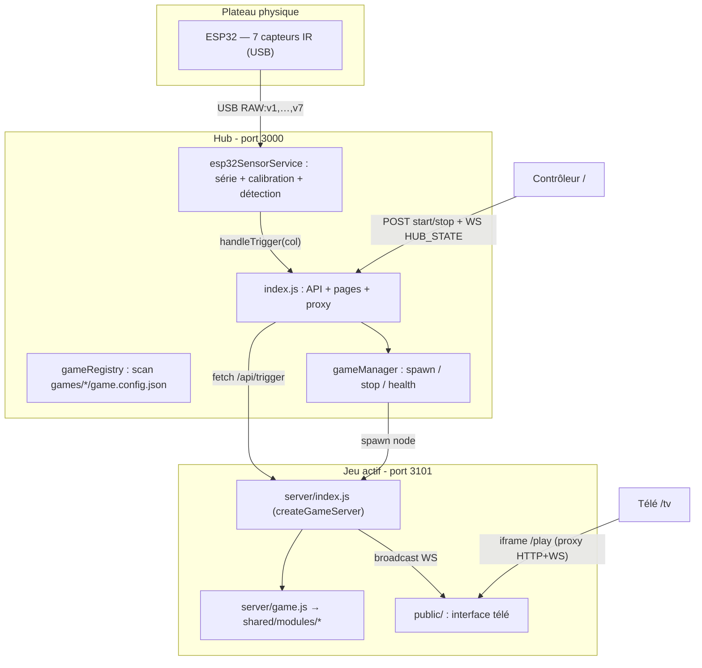
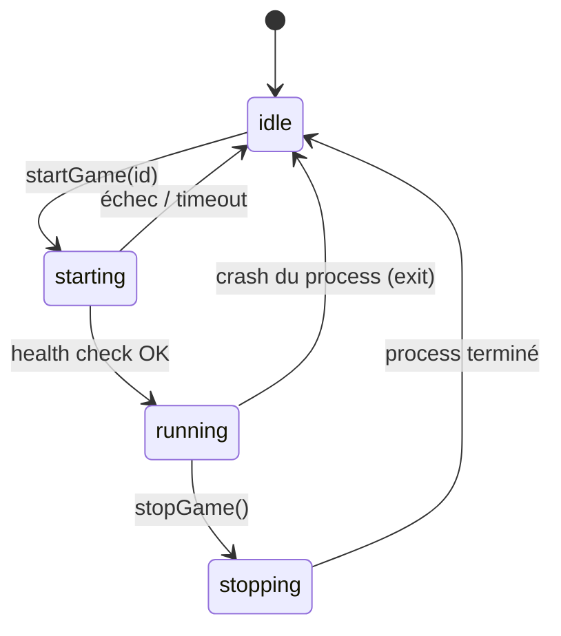

# Architecture — Plateforme BasketGame

> 📖 **À LIRE** avant de modifier `hub/*`, `shared/*` ou un serveur de jeu.
> 🔄 **À METTRE À JOUR** après tout changement de flux, de module, d'endpoint ou de structure.
> Voir la règle complète dans [`AGENTS.md`](../AGENTS.md#-règle-obligatoire--documentation-en-continu).

---

## Vue d'ensemble

BasketGame sépare trois responsabilités :

1. **Le hub** (`hub/`) — serveur principal, sans logique de jeu. Reçoit l'ESP32, découvre les jeux, lance/arrête le jeu actif, proxifie le trafic vers lui et sert les interfaces.
2. **Les jeux** (`games/<id>/`) — autonomes : serveur + interface + logique propre, qui composent les modules partagés.
3. **Le code partagé** (`shared/`) — modules de logique purs et helpers client/serveur réutilisés par les jeux.



---

## Le hub (`hub/`)

| Fichier | Responsabilité |
|---------|----------------|
| [`hub/index.js`](../hub/index.js) | Express, WebSocket de contrôle, proxy `/play`, API, pages `/`, `/tv`, `/sensors` |
| [`hub/esp32SensorService.js`](../hub/esp32SensorService.js) | Port série ESP32, calibration IR, détection balle → triggers jeux, détection impact structure |
| [`hub/gameRegistry.js`](../hub/gameRegistry.js) | Découverte des jeux par scan de `games/*/game.config.json` |
| [`hub/gameManager.js`](../hub/gameManager.js) | Cycle de vie du jeu actif (un seul à la fois) |

### Découverte des jeux

`gameRegistry.listGames()` parcourt `games/`, lit chaque `game.config.json`, valide les champs obligatoires (`id`, `name`, `server.entry`) et renvoie les configs enrichies du chemin du point d'entrée. **Ajouter un jeu ne nécessite aucune modification du hub.**

### Cycle de vie d'un jeu

`gameManager` est une machine à états : `idle → starting → running → stopping → idle`.



- `startGame(id)` lance `node <entry>` en **processus enfant** sur le port `3101` (env `GAME_PORT`), libère d'abord le port si un processus orphelin l'occupe encore (ex. après Ctrl+C), puis attend que `/api/health` réponde avant de passer à `running`.
- À l'arrêt du hub (`SIGINT`/`SIGTERM`), `stopGame()` est appelé puis le port `3101` est libéré.
- `stopGame()` envoie `SIGTERM` (puis `SIGKILL` après 3 s) et revient à `idle`.
- Si le jeu **crash**, l'événement `exit` ramène automatiquement le hub à `idle`.
- Chaque transition émet un événement `change` → le hub diffuse `HUB_STATE` à tous les clients (contrôleur + télé).

### Proxy vers le jeu actif

Le hub proxifie `/play/*` (HTTP **et** WebSocket) vers `http://127.0.0.1:3101` via `http-proxy-middleware` :

- `pathRewrite` retire le préfixe `/play` (`/play/css/x` → `/css/x`).
- Les upgrades WebSocket sur `/play` sont routés vers le proxy ; les autres vers le WebSocket de contrôle du hub.
- Si aucun jeu n'est actif, `/play` renvoie `503`.

La télé charge le jeu dans une **iframe** pointant sur `/play/`, ce qui permet de revenir à l'écran d'attente quand le jeu s'arrête (la page `/tv` garde sa connexion WebSocket au hub). En mode idle, une détection capteur (ou `POST /api/trigger`) diffuse `HUB_TRIGGER` : un 🏀 chute dans la colonne correspondante sur l'écran d'attente (7 couloirs pleine largeur).

---

## Le code partagé (`shared/`)

### Modules de logique (`shared/modules/`) — purs, sans I/O réseau

| Module | Export | Rôle |
|--------|--------|------|
| `grid7` | `Grid` | Grille `rows × cols` (7 colonnes par défaut) + gravité |
| `turn-manager` | `TurnManager` | Alternance circulaire des joueurs |
| `scoring` | `Scoring` | Scores + persistance fichier optionnelle |
| `win-detector` | `findWinningLine` | Détection de N jetons alignés (horizontal, vertical, 2 diagonales) |
| `series` | `getSeriesWinner` | Gagnant d'une série (premier à N victoires) |
| `plinko` | `generateBoard`, `simulateDropSeeded` | Plateau aléatoire + simulation de chute discrète |
| `player-profiles` | `PlayerProfiles` | Profils joueurs (pseudo + 3 photos + tête détourée `cutout.png`) + persistance fichier (`data/players/`) |
| `player-stats` | `recordResult`, `normalizeStats` | Agrégation pure des statistiques par jeu (`win` / `loss` / `tie`) — persistance via `player-profiles` |

> I/O fichier : seuls `scoring`, `player-profiles` (dont `statistics.json`) lisent/écrivent sur disque ; leur persistance reste isolée du reste de la logique.

> Règle : un jeu **compose** ces modules. Toute mécanique réutilisable doit devenir un module plutôt que d'être dupliquée. Voir [`AGENTS.md`](../AGENTS.md#-règle-obligatoire--priorité-aux-modules-partagés).

### Serveur partagé (`shared/server/`)

- [`createGameServer.js`](../shared/server/createGameServer.js) — factory qui monte Express + CORS + JSON, le serveur WebSocket (avec message `INIT` à la connexion), `/api/health`, `/api/log`, le client partagé sous `/shared`, les fichiers statiques du jeu, et un helper `broadcast()`. Le jeu n'enregistre que ses routes propres via le callback `routes(app, broadcast)`.
- [`parseStartParams.js`](../shared/server/parseStartParams.js) — lit `GAME_START_PARAMS` (JSON) passé par le hub au spawn.
- [`parseRoster.js`](../shared/server/parseRoster.js) — extrait le `roster` enrichi (profils choisis) de `GAME_START_PARAMS`.
- [`broadcast.js`](../shared/server/broadcast.js) — `safeSend` et `broadcastTo`.

### Client partagé (`shared/client/`) — servi sous `/shared`

- `effects.js` — particules de fond, confettis, sons (`window.Confetti`, `window.Sounds`).
- `ws-client.js` — `window.WSClient.connect()` avec reconnexion automatique (utilisé par le contrôleur et la télé).
- `column-layout.css` — grille 7 colonnes pleine largeur pour la télé.
- `player-faces.js` / `player-faces.css` — `window.PlayerFaces` : affichage unifié des visages joueurs (choisit la variante `idle` / `win` / `lose` selon le contexte) avec repli « initiales » si pas de roster. Tailles `sm`/`md`/`lg`/`xl`/`xxl`. Expose aussi `getCutoutUrl(slot)` et l'effet réutilisable **têtes qui tombent** (`dropHead(slot, opts)` / `rainHeads(slots, opts)`) : variante `win`/`lose` → photo dédiée ; sinon cutout neutre ou visage circulaire.
- `camera-capture.js` / `camera-capture.css` — `window.CameraCapture.open()` : capture d'une photo carrée via la webcam avec effets façon Snapchat (utilisé par la page de gestion des joueurs). Trois familles d'effets :
  - **Filtres couleur** (N&B, sépia, chaud, froid, vif, vintage) — purs filtres canvas/CSS, aucune dépendance.
  - **Fonds** (flou, couleurs unies, dégradés) — segmentation de la personne via **MediaPipe SelfieSegmentation**.
  - **Lentilles visage** (lunettes soleil, lunettes, couronne, fête, moustache, chien, chat, cœurs) — accessoires **dessinés en vectoriel** (canvas) et calés sur un suivi de visage robuste via **Jeeliz FaceFilter** (centre, échelle, roll de la tête, ouverture de la bouche). Pas d'emoji sur le visage : Jeeliz ne fournit que les données de suivi, le rendu de l'accessoire est fait par `camera-capture.js`.

  Le rendu passe par un canvas (`requestAnimationFrame`) : chaque frame compose fond + personne + lentille ; le filtre couleur et l'effet miroir sont appliqués à l'affichage **et** rebakés à la capture pour garantir que la photo correspond exactement à l'aperçu. Les libs sont chargées **paresseusement depuis un CDN** (MediaPipe via jsDelivr, Jeeliz via `appstatic.jeeliz.com`), uniquement quand un fond ou une lentille est choisi — les filtres couleur restent disponibles hors-ligne. Jeeliz partage l'élément `<video>` existant (un seul `getUserMedia`) et calcule sur un canvas WebGL caché.

  **Option `withCutout`** : si activée (la page joueurs l'utilise pour la photo `idle`), au moment de la capture le module fige la frame brute, la passe dans MediaPipe SelfieSegmentation et compose un **PNG transparent** (personne seule, miroir cohérent avec la photo). La résolution devient alors `{ photo: Blob, cutout: Blob|null }` au lieu de `Blob`. Sans l'option, la signature reste `Promise<Blob|null>` (appelants existants inchangés).

### Profils joueurs côté hub

- [`hub/playerProfiles.js`](../hub/playerProfiles.js) — branche le module `player-profiles` sur `data/players/`, expose le routeur `/api/players` (CRUD + photos + tête détourée `cutout` + `record-game`) et `buildEnrichedRoster()` qui résout les ids choisis en roster enrichi (slot, pseudo, URLs photos ou `null`, `cutoutUrl`) injecté au lancement.
- [`shared/server/reportPlayerStats.js`](../shared/server/reportPlayerStats.js) — helper appelé par les serveurs de jeu en fin de partie pour mettre à jour `statistics.json` via le hub.

---

## Flux de données

### 1. Lancer un jeu (depuis le contrôleur)

```
1. Contrôleur : POST /api/games/<id>/start [body JSON optionnel]
   Ex. Plinko : { "playerCount": 4, "roster": ["<id1>", ...] }
2. Hub : validateStartParams() selon game.config.json → controller.startOptions / requiresPlayerRoster / optionalPlayerRoster
   puis buildEnrichedRoster() résout les profils (pseudo + URLs photos)
3. gameManager.startGame(id, params) → spawn avec env GAME_START_PARAMS (roster enrichi inclus)
4. Attente du health check → status = running
5. Hub diffuse HUB_STATE { status:"running", activeGameId:"<id>", port:3101 }
6. La télé reçoit HUB_STATE → charge l'iframe /play/ (proxy → serveur du jeu)
7. Serveur du jeu : parseStartParams() au boot pour initialiser la partie
```

### 2. Une balle passe dans une colonne

```
1. ESP32 : USB série → RAW:v1,…,v7 (hub/esp32SensorService.js)
2. Hub : calibration + détection (valeur < seuil) → handleTrigger(col)
3. Hub : fetch http://127.0.0.1:3101/api/trigger?col=3
4. Serveur du jeu : game.dropToken(3) (compose grid7 + win-detector + turn-manager + scoring)
5. Serveur du jeu : broadcast({ type:"TOKEN_PLACED" | "GAME_OVER" | "DRAW", ... }) en WS
6. L'iframe du jeu (télé) reçoit le message et anime la grille
```

### 2b. Impact sur la structure (vibration)

Canal **séparé** du trigger colonne — détecté côté hub quand plusieurs capteurs chutent simultanément (module `shared/modules/impact-detector`).

```
1. ESP32 : RAW:v1,…,v7 (~10 ms)
2. Hub : impactDetector.tick() — corrélation multi-capteurs sur fenêtre glissante
3. Hub : WS SENSOR_IMPACT → dashboard /sensors
4. Si jeu actif : POST http://127.0.0.1:3101/api/impact → createGameServer diffuse STRUCTURE_IMPACT en WS → StructureImpact.play() côté télé (iframe /play)
5. Si idle : WS HUB_IMPACT → StructureImpact.play() sur l'écran d'attente /tv

**Mode simulation** (`--simulate` ou `SENSOR_SIMULATE=1`) : pas de port série USB. Les triggers passent par `simulateBallInColumn()` (valeurs ADC virtuelles + même pipeline de détection). Les impacts de test : `POST /api/sensors/simulate/impact`.
```

Paramètres dans `data/sensors-config.json` → section `impactDetection` (`sensitivity` 10–90 %, `peakSamples`). La sensibilité pilote `minDrop`, `minSensors`, `windowMs` et `debounceMs` (plus le % est haut, moins c'est sensible). Réglage live sur `/sensors`.

### 3. Arrêter un jeu

```
1. Contrôleur : POST /api/games/stop
2. gameManager.stopGame() → SIGTERM au process du jeu → status = idle
3. Hub diffuse HUB_STATE { status:"idle", activeGameId:null }
4. La télé masque l'iframe et réaffiche l'écran d'attente
```

---

## Décisions d'architecture

- **Un seul jeu actif à la fois** : simplifie le routage (un seul port `3101`, un seul proxy).
- **Le hub est agnostique** : il ne connaît que le contrat standard d'un serveur de jeu (voir [`API.md`](API.md)). Toute la logique vit dans le jeu ou dans `shared/`.
- **Scores par jeu** : chaque jeu persiste ses propres scores (ex. `games/puissance4/server/scores.json`), le hub n'en gère aucun.
- **Chemins relatifs côté jeu** : l'interface d'un jeu dérive ses URLs API/WS de son chemin (`BASE`), ce qui la rend fonctionnelle derrière le proxy `/play` comme en accès direct au port du jeu.
